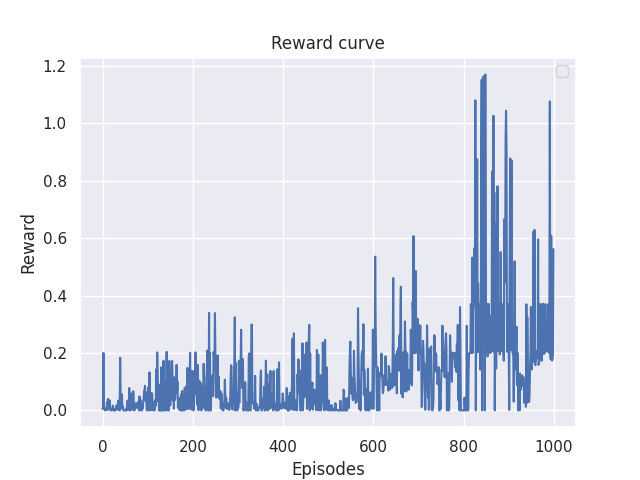

# Race-AI

## Quickstart

To be able to play around with the manual car you can start a http server in
the race directory and open the browser at `localhost:8000`.

```console
cd race
python -m http.server
```

To run the python training script you have to install the dependencies using
venv and run the training script.

```console
python -m venv .venv
source .venv/bin/activate
pip install -r requirements.txt
python src/train.py
```

### Reward Function

To change the default behaviour of the training you can also change the reward function given in [race/rewardFunction.js](race/rewardFunction.js). The reward function receives two arguments, the agent information and the track information.
The `trackInfo` object will contain the `width` and `waypoints` properties. The `width` is the with of the track (from center to the edge). The waypoints variable is an array of `engine.Point` with the waypoints that make the racing track.
The `agentInfo` object contains the player's `position` (Point) and `rotation` (number), the waypoint index of the last passed waypoint `waypointIndex` and the index of the waypoint that the player has to reach `nextWaypointIndex`. The `agentInfo` object has some additional helper properties such as `distanceFromTrack` to determine the distance of the car from the center and `progressDelta` to determine the progress made by the player since the last call to the reward function.

#### Arguments

`agentInfo`
- `position`: `engine.Point` x axis from left to right, y axis from top to bottom
- `rotation`: `number` in radians
- `waypointIndex`: `number` \[0, `waypoints.length`\]
- `nextWaypointIndex`: `number` \(`waypointIndex`+1\)%`waypoints.length`
- `distanceFromTrack`: `number` \[0, inf\]
- `progressDelta`: `number` \[-inf, inf\]

`trackInfo`
- `width`: `number` constant value, default = 50
- `waypoints`: `Point[]` constant value, default `track.track_waypoints.simple`

#### Returns 

- `number`

### Torch Hyperparameters

`learning`:
- `batch_size`: the number of samples to extract from the replay buffer, default=`128`
- `gamma`: discount factor for computing Q values, default=`0.99`
- `replay_buffer_size`: the size of the replay buffer, default=`10000`
- `num_episodes`: the number of episodes to run the algorithm for, default=`1000`
- `learning_starts`: the number of random actions taken by the algorithm, default=`1000`
- `learning_freq`: optimize model paramters every `x` steps, default=`8`
- `target_update_freq`: update the target Q network to the Q network every `x` steps, default=`100`
- `log_every`: log the progress of the learning method every `x` episodes, default=`100`
- `models_path`: folder to save resulting models to, default=`./models`

`environment`:
- `track_name`: the name of the track to use [`simple`, `medium`, `hard`], default=`simple`
- `path`: path to the game script in javascript (change this only if you change the game to something else!), default=`./race/index.js`

`target_function`:
- `target_function_name`: method to use for learning [`dqn`, `ddqn`], default=`ddqn`

`loss`:
- `loss_name`: loss function to use [`huber`], default=`huber`
- `loss_kwargs`: arguments to use when initializing the loss function

`optimizer`:
- `optimizer_name`: optimizer to use [`rmsprop`], default=`rmsprop`
- `optimizer_kwargs`: arguments to use when initializing the optimizer

`eps_scheduler`:
- `eps_scheduler_name`: scheduler to use for the epsilon greedy parameter [`linear`], default=`linear`
- `eps_scheduler_kwargs`: arguments to use when initializing the epsilon scheduler

## Plan

- [X] Implement racing game
    - [X] Map generation (Should be a simple map made with waypoints)
    - [X] Implement a car object that can be moved on the canvas
    - [X] Implement Game Objects to make the Car generation and draw easier
        - [X] Implement Renderer Object to draw shape easier
    - [X] Implement a game loop that takes input from user
    - [X] Implement a game loop that waits input from stdin for training
    - [X] Implement a class that will output data for model input
    - [X] Implement the reward
    - [X] Implement model loading and wait input functions
    - [X] Create more tracks
- [X] Implement RL algorithm to play the racing game
    - [X] Implement OpenAI Gym environment that will use subprocess to run the game
    - [X] Implement DQN algorithm to train a simple model
    - [X] Export model (Maybe to JSON)
    - [X] Implement a game loop that will load the model and use it to generate input
    - [X] Improve model performance
- [X] Make it so that the reward function and config file are easier to edit
    - [X] Config use arguments to python train script --config
    - [X] Create okish folder structure for js scripts and make the reward function more visible

## Results

Right now the model was trained with the default parameters on the simple track and was able to complete one lap on the medium track inside the game.


